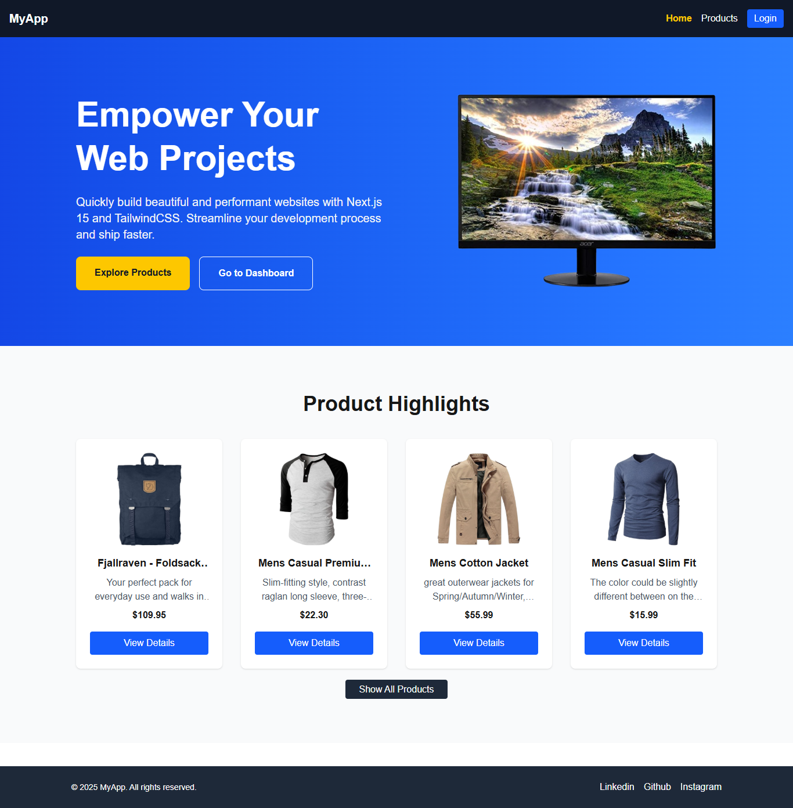

## Next.js Product Dashboard App

A modern web application built with Next.js 15, TailwindCSS, and NextAuth for authentication. Users can browse products, view details, and access a protected dashboard to manage products. Google OAuth login is integrated for secure and easy authentication.

## Features

 Responsive Home page with Hero section, Product Highlights, and Footer
 Product page showing all products fetched from a mock API
 Product details page for individual items
 Protected Dashboard for logged-in users to add and manage products
 Google OAuth login using NextAuth
 Active navigation links and dynamic UI based on login status

## Tech Stack# 

 Frontend: Next.js 15, React, TailwindCSS

 Authentication: NextAuth.js with Google OAuth
 
 Backend: Node.js / Mock API (or your API for products)

This is a [Next.js](https://nextjs.org) project bootstrapped with [`create-next-app`](https://github.com/vercel/next.js/tree/canary/packages/create-next-app).

## Getting Started

First, run the development server:

```bash
npm run dev
# or
yarn dev
# or
pnpm dev
```

Open [http://localhost:3000](http://localhost:3000) with your browser to see the result.

You can start editing the page by modifying `app/page.js`. The page auto-updates as you edit the file.

This project uses [`next/font`](https://nextjs.org/docs/app/building-your-application/optimizing/fonts) to automatically optimize and load [Geist](https://vercel.com/font), a new font family for Vercel.

## Learn More

To learn more about Next.js, take a look at the following resources:

- [Next.js Documentation](https://nextjs.org/docs) - learn about Next.js features and API.
- [Learn Next.js](https://nextjs.org/learn) - an interactive Next.js tutorial.

You can check out [the Next.js GitHub repository](https://github.com/vercel/next.js) - your feedback and contributions are welcome!

## Deploy on Vercel

1. Push your code to GitHub

2. Go to Vercel
 → Click New Project → Import your repository

3. Add the same environment variables in the Vercel dashboard

4. Deploy

Check out our [Next.js deployment documentation](https://nextjs.org/docs/app/building-your-application/deploying) for more details.

